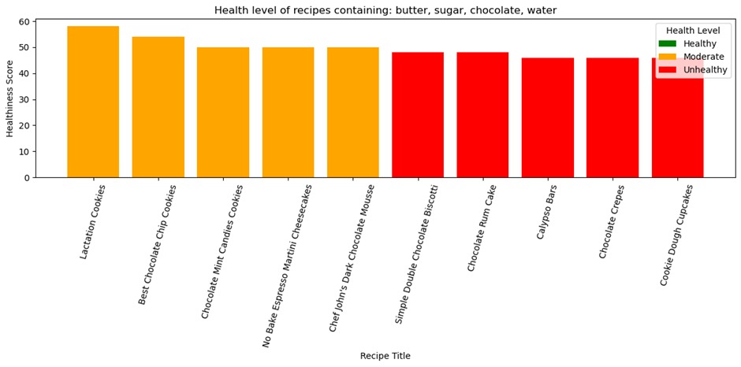
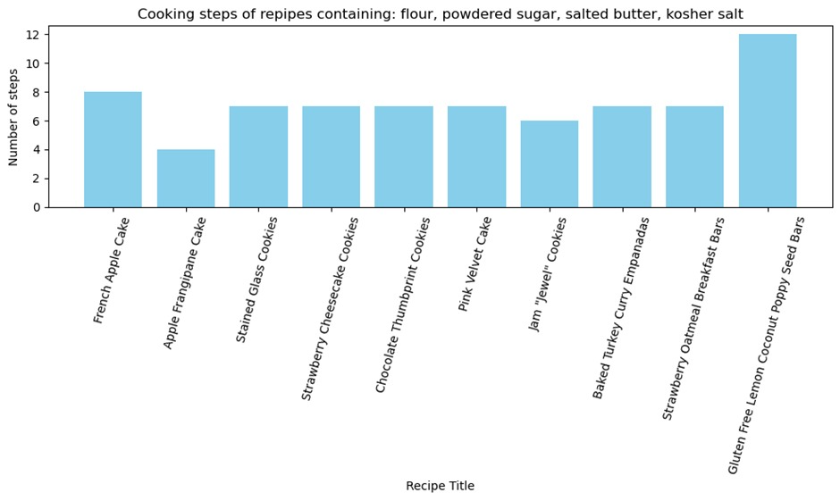
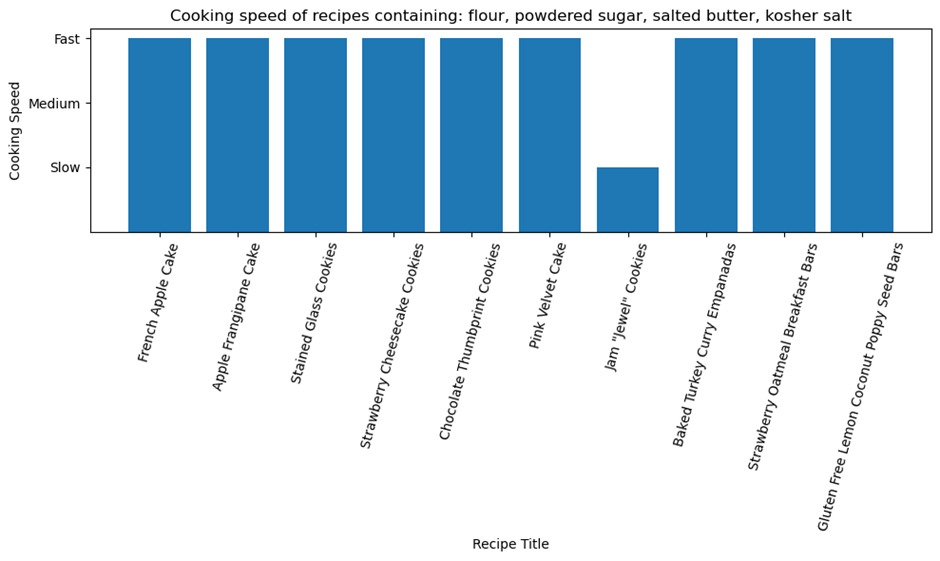

# Recipe Generator - Project PRA2031
> This project is a recipe generator built in Python using object oriented programming (OOP) principles. The program allows users to input their available ingredients and specify dietary restrictions. Based on these inputs, the application generates a selection of suitable dishes, displays their respective healthiness scores and number of steps in a graph format, and enables the user to choose a preferred dish. Once selected, the full recipe is presented to the user.


## Table of Contents
* [Purpose](#purpose)
* [Features](#features)
* [Data Description](#data-description)
* [Setup](#setup)
* [Usage](#usage)
* [Visualizations](#visualizations)
* [Project Status](#project-status)
* [Future Directions/Improvements](#future-directions/Improvements)
* [Contact](#contact)

  
## Purpose
We built the Recipe Generator with the aim to simplify everyday cooking by helping users turn available ingredients into suitable and healthy recipes, regardless of their dietary needs or cooking experience. We undertook this project specifically because, as students, we often struggle to decide what to cook with limited ingredients and thought it would be a very useful program to have.


## Features
<ins>Classes</ins>
- Ingredients
- Dietary restriction
- Healthiness score
- Recipe
  
> To keep the project organized, each class was created in its own file. These classes are then imported and used together in a main file, which controls the overall program flow.

## Data Description
All data was obtained from Kaggle and filtered to fit Git size restrictions. 
[Extended Recipes Dataset](https://www.kaggle.com/datasets/wafaaelhusseini/extended-recipes-dataset-64k-dishes?resource=download)

## Setup

Follow these steps to run the Recipe Generator locally:

1. Clone the repository:
   ```bash
   git clone https://github.com/camillewyd/Recipe-Generator-PRA2031.git
   cd Recipe-Generator-PRA2031
   ```

2. Make sure Python 3.9 or newer is installed:
   ```bash
   python --version
   ```

3. Install required library:
   ```bash
   pip install pandas
   ```

4. Ensure the dataset file  
   `final_filtered_recipes.csv`  
   is located inside the project folder.

5. Run the program:
   ```bash
   python generator.py
   ```


## Usage

1. Run the program:

   ```bash
   python generator.py
   ```

2. When prompted, enter the ingredients you currently have available.
   - Ingredients must be separated by commas.

3. The program will:
   - Load recipes from the CSV file
   - Compare your ingredients to each recipe
   - Calculate how many ingredients match
   - Sort recipes by best match

4. The top 3 best matching recipes (or fewer if less are available) will be displayed.

5. For each suggested recipe, the program shows:
   - Full ingredient list
   - Missing ingredients (if any)
   - Step by step directions

If no matches are found, the program will suggest entering more common ingredients.


## Visualizations
> Examples of user interface visualizations 
<h4>Healthiness Score Comparison of Suggested Recipes</h4>


<h4>Comparison of Number of Preparation Steps per Recipe</h4>


<h4>Comparison of Cooking Speed of Suggested Recipes</h4>



## Project Status
_in progress_


## Future Directions/Improvements
- **Advanced nutritional analysis**: Integrate a nutritional API to provide detailed breakdowns (calories, macronutrients, micronutrients) instead of a simplified healthiness score.
- **Machine learning integration**: Use recommendation algorithms to suggest recipes based on user history and behavior.
- **Expand the recipe database**: Increase the number and diversity of recipes, including international cuisines and more specialized dietary categories 


## Contact
Created by @camillewyd, @antoniaosorio123-sudo, @abrahamjessica1170-dev, @joana66-jpg, and @bezuidenhoutxena - feel free to contact us!
